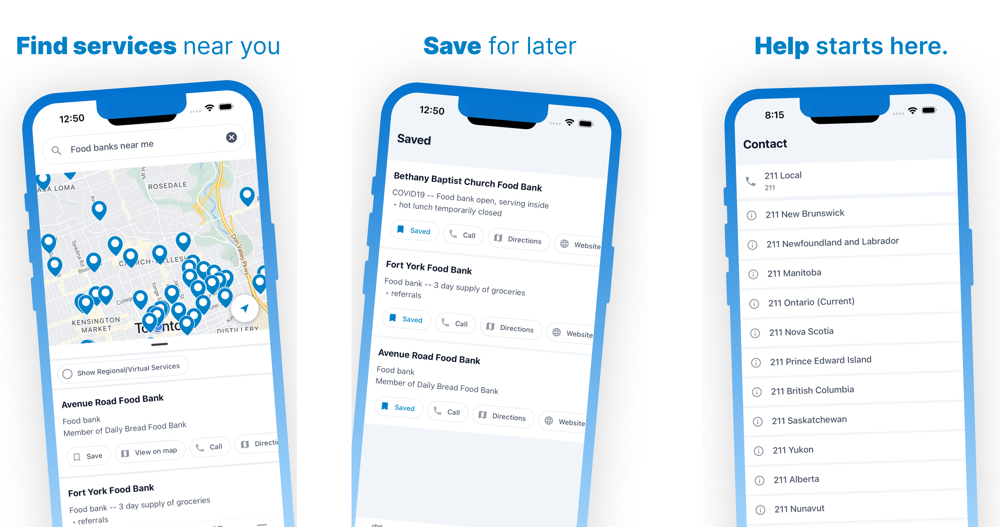

The 211 App is a national service finder. Find anything from food banks to employment, and much more.

## Features

This app provides many features, such as:

- Map Search
- Saving Services
- Updates from 211
- Bilingual
- Contact details for each 211 across Canada

## How it is made

This app is made using React Native, Expo, Tailwind, and more. There is also a backend admin portal made using PayloadCMS and Nextjs, that allows admins to send updates, manage their 211, and more. 
