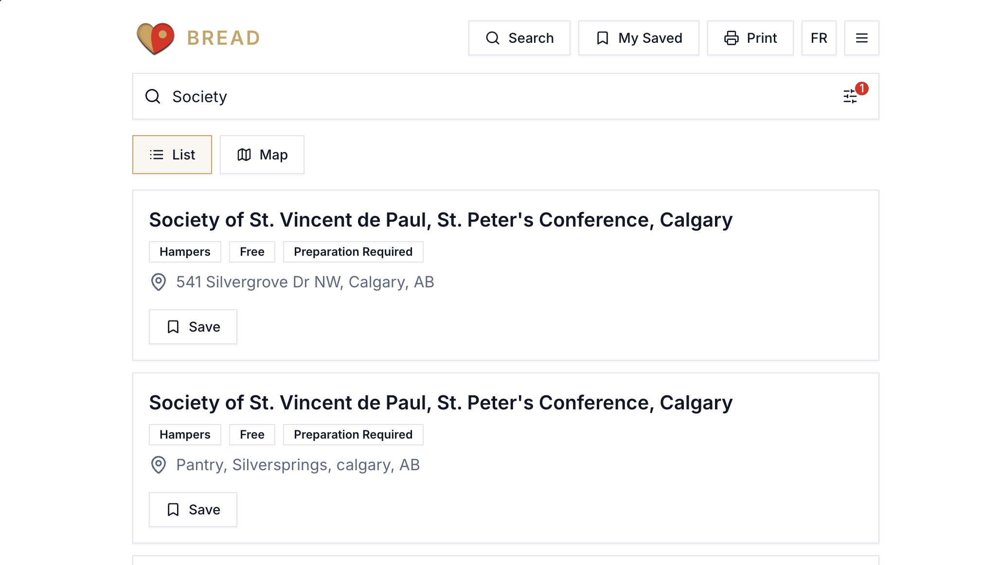

Bread is a food bank search website with a food provider admin portal. It is provided by Technology Helps.

## Features

**Search Portal**
- Map/List Search
- Tons of filters (Free, Wheelchair Accessible, Parking, Dietary Options, etc)
- Save Food Banks
- Scheduling Saved
- Print

**Admin**
- Create Listings
- Manage Your Provider
- View analytics
- New provider verification system

## How it is made

Bread is made using Tanstack Start, Tailwind, Shadcn, Postgres w/Drizzle, Tanstack Form and more. 

